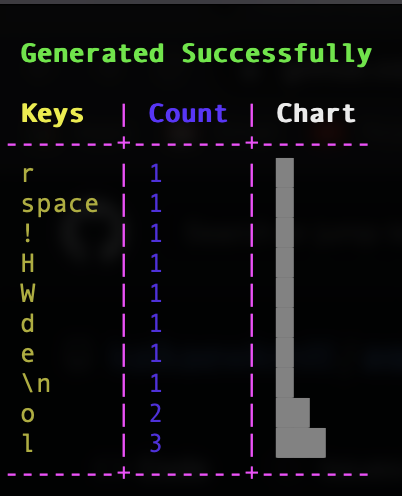

# ASCII Chart Generator

Counts ASCII characters from files provided then generates a chart displaying counts of each character

KMITL's C-programming project by Mahnun Saratunti (64011456)

## Preview


## Requirement

- CMake for building the project
- **(optional)** Makefile
- **(optional)** global env variable COLUMNS, which is the terminal's width, to be set ([more on how to set](#setting-columns-variable))

## Install

### Using Cmake only

#### For Mac:

```
git clone https://github.com/kaikaewkmitl/ascii-chart.git
cd ascii-chart
mkdir build && cd build
cmake .. && cmake --build .
cd ..
```

#### For Bash, Powershell(with MinGW):

```
git clone https://github.com/kaikaewkmitl/ascii-chart.git
cd ascii-chart
mkdir build
cd build
cmake -G "MinGW Makefiles" ..
cmake --build .
cd ..
```

to enable unicode in Powershell enter ```chcp 65001``` into the shell in the project directory

### Using Makefile and Cmake

```
git clone https://github.com/kaikaewkmitl/ascii-chart.git
cd ascii-chart
make build
```

### Setting COLUMNS variable

without setting COLUMNS variable, the program will use default ```screenWidth``` value (168)

#### To set COLUMNS in Mac or Bash:

```
export COLUMNS
```

#### To set COLUMNS in Powershell:

```
$env:COLUMNS = $Host.UI.RawUI.WindowSize.Width
```

## Run

```
./ascii-chart [-f files...] [-a] [-u]
```

Without any flags the program would run in default mode, with messages prompting for files. With ```-f``` flag provided and files, program would skip the files prompting process and generate a chart right away. The chart is ordered in descending order by default, user can change the ordering by providing the ```-a``` flag. To display a chart in unicode mode as shown on the [preview](#preview), use ```-u``` flag.

More information about flags can be obtained by providing help flag:

```
./ascii-chart -h
```

## Example

### Input

This example simply reads a text file 'file.txt' with content 'Hello World!' inside. Then displays chart in ascending fashion with ```-a``` flag in unicode mode using ```-u``` flag.

```
echo 'Hello World!' > file.txt && ./ascii-chart -f file.txt -a -u
```

### Output


