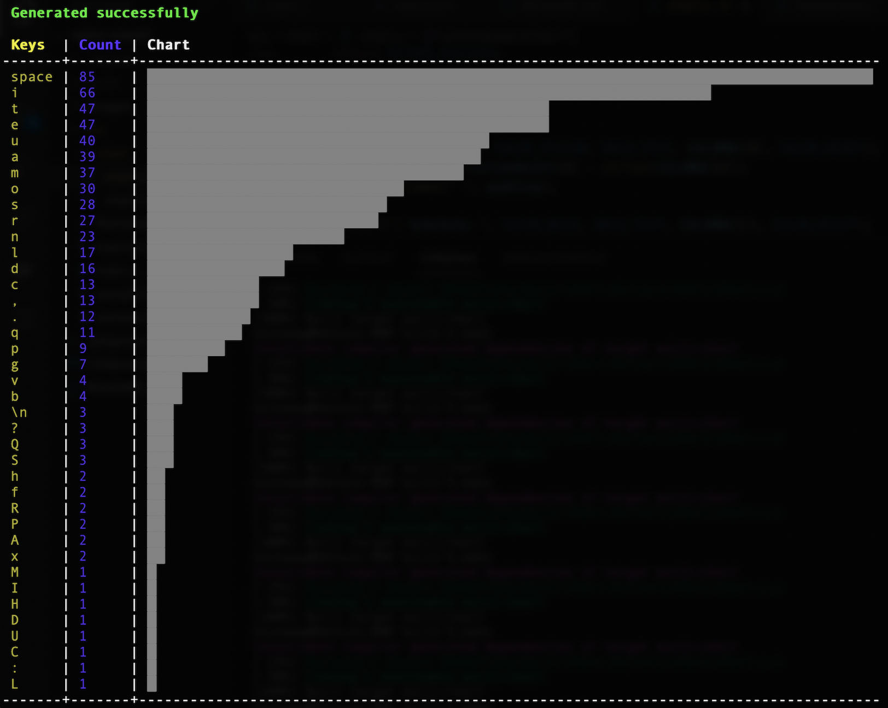

# ASCII Chart Generator

Counts ASCII characters from files provided then generates a chart displaying counts of each character

KMITL's C-programming project by Mahnun Saratunti (64011456)

## Preview



## Install

```
git clone https://github.com/kaikaewkmitl/ascii-chart.git
cd ascii-chart
mkdir build && cd build
cmake .. && cmake --build .
cd ..
```

or with Makefile

```
git clone https://github.com/kaikaewkmitl/ascii-chart.git
cd ascii-chart
make build
```

the executable is called 'ascii-chart'

## Run

```
./ascii-chart [-f files...] [--asc]
```

Without any flags the program would run in default mode, with messages prompting for files. With ```-f``` flag provided and files, program would skip the files prompting process and generate a chart right away. The chart is ordered in descending order by default, user can change the ordering by providing the ```--asc``` flag.
